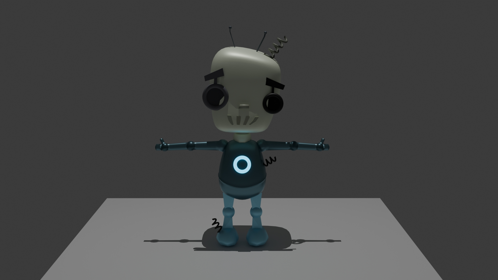

# 🎨 3D Models Portfolio

This repository contains my 3D modeling projects created with **Blender** as part of my journey in learning 3D art, character creation, and game asset development.

## 📂 Projects

### 🤖 Robot

My first 3D model created in Blender.

**Goals:**

* Learning Blender's interface and workflow
* Basic hard-surface modeling
* Materials and rendering fundamentals
* Understanding topology basics

### 🧑‍🎨 Anime Character *(Work in Progress)*
<figure align="center">
  
  <figcaption>طرح رفرنس</figcaption>
</figure>
A stylized 3D anime character currently under development.

**Focus Areas:**

* Character modeling
* Topology and edge flow
* Facial features and proportions
* Clothing creation
* Character art workflow

## 🚀 About This Repository

This repository serves as a collection of my 3D modeling projects and learning progress.

As I continue to improve my skills, new models, updates, and refinements will be added here.

## 🛠️ Tools

* Blender

## 📈 Status

| Project         | Status         |
| --------------- | -------------- |
| Robot           | ✅ Completed    |
| Anime Character | 🚧 In Progress |

## 💬 Feedback

Feedback, suggestions, and contributions are welcome.
